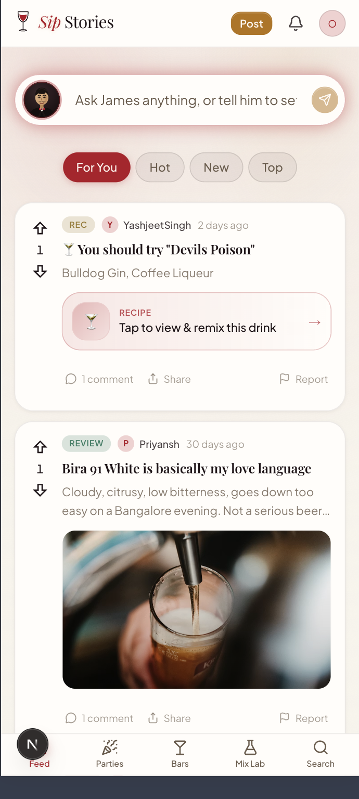
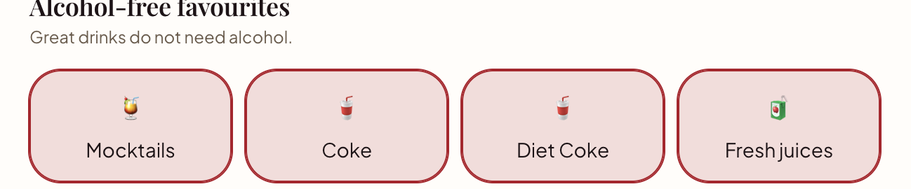

# SipStories

SipStories is an invite-only, pseudonymous social app for adults to discover drinks, share stories with their circle, plan occasions, and get grounded suggestions from James, the in-app bartender.

It is built for India's drinking culture, but it does not sell, order, or deliver alcohol. The product is 21+ and carries responsible-drinking guidance throughout.



## What members can do

- **Build a taste profile** through a short onboarding flow covering preferred drinks, alcohol-free options, flavour notes, discovery style, and visual vibe.
- **Discover drinks and cocktails** through searchable catalogues, typo-tolerant James search, recipe cards, and Mix Lab creations.
- **Ask James** for a cocktail idea, food pairing, a recommendation, or help navigating the product. James can surface real catalogue results and change the app's visual vibe.
- **Share with a circle** by publishing stories, commenting, voting, tagging friends, sending posts directly, and receiving notifications.
- **Plan a party** by inviting friends, collecting RSVPs, choosing drinks, and sharing an invite link.
- **Browse bars and occasions** with bar listings, reviews, mood-led discovery, and cocktail recipes.
- **Stay in control** with a help centre, Hangover SOS guidance, reporting and moderation, privacy controls, and age/compliance gates.

## A member journey

### 1. Join by invitation

Members create a pseudonymous account, verify their email, confirm they are 21+, and enter an invite/referral code. This keeps the community intentional while allowing people to participate without using their real name publicly.

### 2. Tell SipStories what you enjoy

Onboarding starts with drinks and flavours, including non-alcoholic choices. A member who selects only alcohol-free options is treated as alcohol-free for future James suggestions.



The next step asks how adventurous the member is with drinks and what visual vibe they prefer. The selected vibe changes the app theme immediately and is saved to the profile.

### 3. Explore the feed and ask James

The feed brings together stories from the community, drink and cocktail prompts, and the James composer. Members can switch between personalised, popular, recent, and top views; open a recipe; comment; share; or report content.

James is grounded in the SipStories catalogue. He can return relevant drink and cocktail cards, open a relevant area of the app, or set a theme when asked. Each member's saved preferences and lightweight interaction signals help make his future context more relevant.

### 4. Discover, make, and gather

- **Drinks and cocktails:** Browse catalogues, inspect details, save favourites, and use fuzzy search when a name is misspelled.
- **Mix Lab:** Create and share original cocktail recipes, with visibility controls for the creator and their circle.
- **Parties:** Set up a house party or bar plan, invite a circle, track RSVPs, and add drinks through the catalogue search.
- **Vibe and bars:** Pick a mood to explore matching drinks and recipes, or browse bars and their community reviews.

### 5. Shape a personal experience over time

SipStories keeps a compact, per-member taste profile built from onboarding choices and voluntary in-app activity such as saved favourites, reviews, and viewed drinks. James questions also store a small set of keywords with the member's interaction record. These signals are stored for future personalisation work; they do not expose a member's private conversations in the community feed.

## Core product areas

| Area | What it provides |
| --- | --- |
| Feed | Community stories, votes, comments, mentions, post sharing, notifications, and personalised ordering. |
| James | A responsible in-app bartender with catalogue-aware suggestions, app actions, and compact per-user context. |
| Drinks and cocktails | Searchable catalogue, detail pages, filters, flavours, recipes, favourites, and fuzzy name matching. |
| Mix Lab | A place to create, publish, and discover member-made cocktail recipes. |
| Parties | Party planning, guest invitations, RSVPs, drink suggestions, and shareable invite links. |
| Circle | Friend connections, direct post sharing, member tagging, and private Mix Lab visibility. |
| Bars and Vibe | Mood-led discovery, bar listings, community reviews, and theme selection. |
| Care and trust | 21+ acknowledgement, responsible-drinking help, Hangover SOS, reporting, moderation, and admin tools. |

## Responsible use and privacy

- SipStories is for adults aged 21 and over.
- It provides discovery, community, and informational content only. It does not promote, sell, or arrange alcohol delivery.
- James is instructed not to encourage excessive drinking, drunk driving, unsafe behaviour, or medical misinformation.
- Profiles use pseudonyms by default. A member controls what they share, and can report content or seek help from within the product.
- Personalisation signals are stored per member and are not shown as public profile data.

## How it is built

```text
Next.js + React UI
        |
        +-- Clerk email verification and app sessions
        +-- Prisma ORM
        |       |
        |       +-- Supabase Postgres (profiles, catalogues, posts, parties, interactions)
        |
        +-- Supabase storage (member uploads)
        +-- Groq + LangChain (James, grounded with the catalogue)
        +-- Vercel Cron (taste-vector and similarity refreshes, retention jobs)
```

### Personalisation, at a glance

1. Onboarding records stated preferences such as favourite drink types, flavours, discovery style, and vibe.
2. Activity such as favourites, views, reviews, and posts contributes to a compact taste vector.
3. The feed and James read this prepared profile to tailor results without running expensive calculations on every page load.
4. James interaction keywords are retained as future product signals. They are not yet used to change ranking or recommendations on their own.

## Local setup

### Prerequisites

- Node.js 20+
- A Supabase Postgres project
- A Clerk project for email verification
- A Groq API key to enable James

### Run the app

```bash
git clone https://github.com/priyanshty19/LCohol.git
cd LCohol
npm install
cp .env.example .env.local

# Add the required values to .env.local, then generate the Prisma client.
npx prisma generate

# The existing Supabase database was bootstrapped with db push.
npx prisma db push

# Optional: populate the catalogue and example data.
npm run db:seed
npx tsx prisma/seed-bars.ts
npx tsx prisma/seed-posts.ts
npm run dev
```

Open [http://localhost:3000](http://localhost:3000).

### Environment configuration

See [`.env.example`](.env.example) for the complete list. The important values are:

| Variable | Purpose |
| --- | --- |
| `DATABASE_URL` | Runtime Supabase transaction-pooler connection. |
| `DIRECT_URL` | Direct/session connection for schema work. |
| `CLERK_SECRET_KEY` and `NEXT_PUBLIC_CLERK_PUBLISHABLE_KEY` | Email verification and authentication. |
| `SESSION_SECRET` | Signs the application session cookie. |
| `GROQ_API_KEY` | Enables James. |
| `CRON_SECRET` | Secures scheduled recompute and retention jobs. |
| VAPID and Resend values | Optional push notifications and email notifications. |

## Checks

```bash
npm test
npm run lint
npm run build
```

## Deployment notes

The application is designed for Vercel with Supabase. Add the environment variables in the Vercel project and configure `CRON_SECRET` for scheduled jobs.

The established development schema workflow is `npx prisma db push`; do not run `prisma migrate dev` against the shared Supabase database history because it may request a destructive reset. When a reviewed SQL migration is included, apply it deliberately through the team's Supabase rollout process and test it before production. Never run destructive reset commands against a shared database.

## Repository map

| Path | Purpose |
| --- | --- |
| `src/app` | App pages and API routes. |
| `src/components` | Product UI grouped by feature. |
| `src/lib` | Product logic, data access, James, personalisation, and safety helpers. |
| `prisma/schema.prisma` | Database models. |
| `prisma/` and `scripts/` | Seed data, migrations, and database utilities. |
| `docs/screenshots` | README walkthrough screenshots. |

## Contributing

1. Create a focused branch.
2. Keep changes scoped to the relevant product area.
3. Run the checks above.
4. Open a draft pull request with the user impact and database rollout notes.

---

SipStories is a community product. Keep it welcoming, responsible, and useful.
